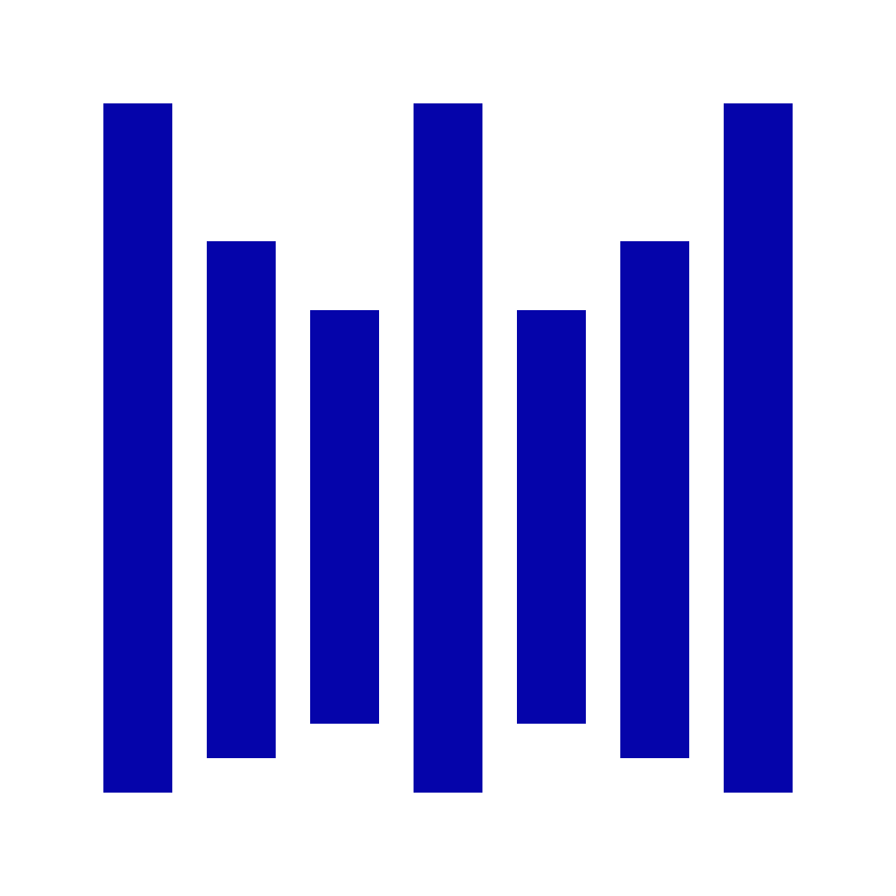

# Celestinal

----

Distributed Log Aggregator

A system that centralizes logs from multiple microservices in a Cloud Native environment.

----

**Requirement**:
- Go 1.24.2, Protocol Buffer
- Make (for running commands efficiently)

**Main features**:
- Distributed log collector (pull/push and agent-based)
- Filter and display logs by namespace, service
- Alert when logs containing critical errors are detected
- Customizable Dashboard with Multiple Charts

**Extensions**:
- Support tracing with OpenTelemetry
- Provide an API to query logs using SQL-like language

## License

Copyright (c) Celestinal Labs. All rights reserved.

Licensed under the [Apache 2.0](LICENSE) license.

### Logo

  
  
  
  

  
**Celestinal** – photo by **Duc-Hung Ho**  
Licensed under [CC BY-SA 4.0](https://creativecommons.org/licenses/by-sa/4.0/)
